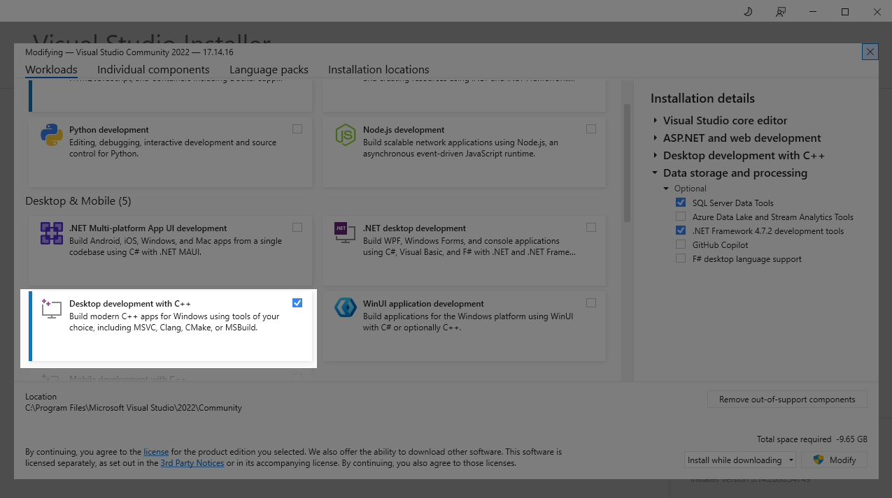

# Compiling
This section details the build process for the **apollo-spc-program** and **play** apps on Windows 10/11.

## Required
- Zig 0.14.1 -- **Later versions will not work!**

## Optional
The items in the list below are only needed if you wish to compile the **play** launcher utility. If you only want **apollo-spc-program**, these can be skipped:
- Dotnet SDK 8.0+
- Visual Studio 2022 "Desktop development with C++" workload

## Zig Installation
Download Zig 0.14.1 (Windows x86_64) from https://ziglang.org/download/0.14.1/zig-x86_64-windows-0.14.1.zip

Extract the archive to your desired location, then open up a new Powershell window (or Windows Terminal with a Powershell profile). Add the directory path containing the `zig` executable to your `PATH` environment variable with the following command (Replace `C:\path\to\folder\with\zig\binary`) below:

```powershell
$zigPath = "C:\path\to\folder\with\zig\binary"
$env:Path = $zigPath + ";" + $env:Path
$newPath = $zigPath + ";" + [System.Environment]::GetEnvironmentVariable("PATH", "User")
[System.Environment]::SetEnvironmentVariable("PATH", $newPath, "User")
```

Check to make sure Zig is installed correctly with the following command:

```bash
zig version
```

If you see `0.14.1` as your output, you are good to continue on to the next steps. If you see any other version number, or "command not found", then something went wrong during download or path setup.

## Dotnet Installation
Note: The below steps are technically optional. If you wish to see how to build and run the app without dotnet or Visual Studio, see the [Building the CLI App Only](#building-the-cli-app-only) section below.

Firstly, before doing anything, you will want to create a new persistent environment variable named `DOTNET_CLI_TELEMETRY_OPTOUT` and set its value to `1`. This will prevent further data collection by Microsoft while using the dotnet toolchain (https://learn.microsoft.com/en-us/dotnet/core/tools/telemetry#how-to-opt-out).

```powershell
[Environment]::SetEnvironmentVariable('DOTNET_CLI_TELEMETRY_OPTOUT', 1, 'User')
$env:DOTNET_CLI_TELEMETRY_OPTOUT = 1
```

Now you're ready to install the dotnet SDK for Windows. First, download from the official dotnet SDK link:
https://builds.dotnet.microsoft.com/dotnet/Sdk/9.0.305/dotnet-sdk-9.0.305-win-x64.exe

Open the setup exe and follow the prompts until the installation is complete.

## Installing the Visual Studio C++ Workload

The **play** app utilizes dotnet's Ahead-Of-Time (AOT) compilation features. In order to build projects which use these features, you will first need to download and install Visual Studio 2022 if you haven't already.

If you already have Visual Studio 2022, create or open up any project, go to the "Tools" menu in the top menu bar and click on "Get Tools and Features..." (This should be the very first item in the drop-down menu).

You should see a menu like the one below. Enable the checkbox in the highlighted area:


Click on the Modify button in the bottom-right corner (or Install if it's a fresh Visual Studio installation), then wait for the feature to finish downloading and installing.

Once that is complete, you are ready to move on to the next build steps!

## Building
To build the project in full, simply navigate to the root folder of your cloned git repo in a Powershell window and type:

```bash
.\build.ps1
```

This will build the entire project as whole. This includes the Zig CLI app **apollo-spc-program**, as well as the dotnet launcher app **play**.

If the build is successful--and assuming you have already met the prerequisites for running the app itself--you can now run the freshly built app from the `bin\` folder by entering:
```bash
bin\play.exe "<path-to-your-spc-file.spc>"
```

## Building the CLI App Only
If you do not wish to install the dotnet SDK onto your machine, you can choose to build just the Zig CLI app: **apollo-spc-program**. This is the actual program which interprets your SPC file.

You can build the CLI app using the following command (in either cmd or Powershell):

```bash
src\zig-build.bat
```

Please be aware that without the **play** app, there are a few differences in how you will launch it (more details in the section on running in README.md), as well as some possible visual glitching upon starting and exiting the app. 

Apart from these, the app should function pretty much the same.
